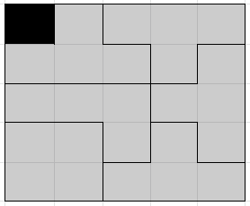

# Informe I: Heurísticas de Búsqueda

## Integrantes

* Christian Oliveros 13-11000
* Yuni Quintero 14-10880

## Branching

Para realizar los estudios de branching se decidió utilizar el algoritmo de Interactive Deepening, modificado para que contara cuantos hijos quedaban abiertos por nivel.

Las pruebas consistieron en dejar el programa corriendo por 15 minutos y luego cortarlo para ver hasta que nivel llegó. Las pruebas se realizaron utilizando el autómata de prunning de PSVN tamaño 0 y tamaño 1.

### Pruebas

| Depth | Generated | Branching |  Elapsed |  NodesPerMs |
|:-----:|:---------:|:---------:|:--------:|:-----------:|
|   1   |     2     |  2.000000 |    0ms   |   1.#INF00  |
|   2   |     6     |  3.000000 |    0ms   |   1.#INF00  |
|   3   |     18    |  3.000000 |    0ms   |   1.#INF00  |
|   4   |     58    |  3.222222 |    0ms   |   1.#INF00  |
|   5   |    186    |  3.206897 |    0ms   |   1.#INF00  |
|   6   |    602    |  3.236559 |    1ms   |  602.000000 |
|   7   |    1946   |  3.232558 |    1ms   | 1946.000000 |
|   8   |    6298   |  3.236382 |    3ms   | 2099.333333 |
|   9   |   20378   |  3.235630 |   13ms   | 1567.538462 |
|   10  |   65946   |  3.236137 |   44ms   | 1498.772727 |
|   11  |   213402  |  3.236011 |   145ms  | 1471.737931 |
|   12  |   690586  |  3.236080 |   455ms  | 1517.771429 |
|   13  |  2234778  |  3.236060 |  1552ms  | 1439.934278 |
|   14  |  7231898  |  3.236070 |  4669ms  | 1548.917970 |
|   15  |  23402906 |  3.236067 |  15109ms | 1548.938116 |
|   16  |  75733402 |  3.236068 |  49597ms | 1526.975462 |
|   17  | 245078426 |  3.236068 | 161436ms | 1518.115080 |
|   18  | 793090458 |  3.236068 | 516375ms | 1535.880819 |

*Tabla 1:* 15 Puzzle con historia 0.

| Depth | Generated | Branching |  Elapsed |  NodesPerMs |
|:-----:|:---------:|:---------:|:--------:|:-----------:|
|   1   |     2     |  2.000000 |    0ms   |   1.#INF00  |
|   2   |     4     |  2.000000 |    0ms   |   1.#INF00  |
|   3   |     10    |  2.500000 |    0ms   |   1.#INF00  |
|   4   |     24    |  2.400000 |    0ms   |   1.#INF00  |
|   5   |     54    |  2.250000 |    0ms   |   1.#INF00  |
|   6   |    108    |  2.000000 |    0ms   |   1.#INF00  |
|   7   |    218    |  2.018519 |    0ms   |   1.#INF00  |
|   8   |    472    |  2.165138 |    0ms   |   1.#INF00  |
|   9   |    1030   |  2.182203 |    1ms   | 1030.000000 |
|   10  |    2204   |  2.139806 |    1ms   | 2204.000000 |
|   11  |    4666   |  2.117060 |    6ms   |  777.666667 |
|   12  |    9880   |  2.117445 |   13ms   |  760.000000 |
|   13  |   21046   |  2.130162 |   24ms   |  876.916667 |
|   14  |   44972   |  2.136843 |   63ms   |  713.841270 |
|   15  |   95930   |  2.133105 |   138ms  |  695.144928 |
|   16  |   204216  |  2.128802 |   207ms  |  986.550725 |
|   17  |   434694  |  2.128599 |   500ms  |  869.388000 |
|   18  |   925980  |  2.130188 |   976ms  |  948.750000 |
|   19  |  1973338  |  2.131081 |  1812ms  | 1089.038631 |
|   20  |  4204856  |  2.130834 |  4120ms  | 1020.596117 |
|   21  |  8957558  |  2.130289 |  8313ms  | 1077.536148 |
|   22  |  19080940 |  2.130150 |  16342ms | 1167.601273 |
|   23  |  40648730 |  2.130332 |  35306ms | 1151.326403 |
|   24  |  86600984 |  2.130472 |  73892ms | 1171.994045 |
|   25  | 184499846 |  2.130459 | 161595ms | 1141.742294 |
|   26  | 393057052 |  2.130392 | 343790ms | 1143.305658 |

*Tabla 2:* 15 Puzzle con historia 1.

| Depth | Generated | Branching |  Elapsed |  NodesPerMs |
|:-----:|:---------:|:---------:|:--------:|:-----------:|
|   1   |     2     |  2.000000 |    0ms   |   1.#INF00  |
|   2   |     6     |  3.000000 |    0ms   |   1.#INF00  |
|   3   |     18    |  3.000000 |    0ms   |   1.#INF00  |
|   4   |     60    |  3.333333 |    0ms   |   1.#INF00  |
|   5   |    198    |  3.300000 |    1ms   |  198.000000 |
|   6   |    684    |  3.454545 |    1ms   |  684.000000 |
|   7   |    2322   |  3.394737 |    1ms   | 2322.000000 |
|   8   |    8100   |  3.488372 |    5ms   | 1620.000000 |
|   9   |   27702   |  3.420000 |   20ms   | 1385.100000 |
|   10  |   96876   |  3.497076 |   75ms   | 1291.680000 |
|   11  |   331938  |  3.426421 |   314ms  | 1057.127389 |
|   12  |  1161540  |  3.499268 |   927ms  | 1253.009709 |
|   13  |  3981798  |  3.428033 |  3074ms  | 1295.314899 |
|   14  |  13935564 |  3.499817 |  11489ms | 1212.948385 |
|   15  |  47777202 |  3.428437 |  35680ms | 1339.047141 |
|   16  | 167218020 |  3.499954 | 120025ms | 1393.193251 |
|   17  | 573313302 |  3.428538 | 402012ms | 1426.109922 |

*Tabla 3:* 24 Puzzle con historia 0.

| Depth | Generated | Branching |  Elapsed |  NodesPerMs |
|:-----:|:---------:|:---------:|:--------:|:-----------:|
|   1   |     2     |  2.000000 |    0ms   |   1.#INF00  |
|   2   |     4     |  2.000000 |    0ms   |   1.#INF00  |
|   3   |     10    |  2.500000 |    0ms   |   1.#INF00  |
|   4   |     26    |  2.600000 |    0ms   |   1.#INF00  |
|   5   |     64    |  2.461538 |    0ms   |   1.#INF00  |
|   6   |    160    |  2.500000 |    0ms   |   1.#INF00  |
|   7   |    372    |  2.325000 |    0ms   |   1.#INF00  |
|   8   |    888    |  2.387097 |    1ms   |  888.000000 |
|   9   |    1996   |  2.247748 |    0ms   |   1.#INF00  |
|   10  |    4872   |  2.440882 |    4ms   | 1218.000000 |
|   11  |   11324   |  2.324302 |    9ms   | 1258.222222 |
|   12  |   27608   |  2.438008 |   23ms   | 1200.347826 |
|   13  |   63524   |  2.300927 |   58ms   | 1095.241379 |
|   14  |   154560  |  2.433096 |   159ms  |  972.075472 |
|   15  |   355836  |  2.302252 |   340ms  | 1046.576471 |
|   16  |   866008  |  2.433728 |   929ms  |  932.193757 |
|   17  |  1993748  |  2.302228 |  1738ms  | 1147.150748 |
|   18  |  4854112  |  2.434667 |  4423ms  | 1097.470495 |
|   19  |  11181004 |  2.303409 |  10992ms | 1017.194687 |
|   20  |  27216632 |  2.434185 |  23118ms | 1177.291807 |
|   21  |  62666404 |  2.302504 |  56618ms | 1106.828288 |
|   22  | 152545216 |  2.434242 | 136075ms | 1121.037781 |
|   23  | 351287868 |  2.302844 | 306261ms | 1147.021227 |

*Tabla 4:* 24 Puzzle con historia 1.

| Depth | Generated | Branching |  Elapsed |  NodesPerMs |
|:-----:|:---------:|:---------:|:--------:|:-----------:|
|   1   |     3     |  3.000000 |    0ms   |   1.#INF00  |
|   2   |     15    |  5.000000 |    0ms   |   1.#INF00  |
|   3   |     75    |  5.000000 |    0ms   |   1.#INF00  |
|   4   |    393    |  5.240000 |    0ms   |   1.#INF00  |
|   5   |    2109   |  5.366412 |    0ms   |   1.#INF00  |
|   6   |   11487   |  5.446657 |   15ms   |  765.800000 |
|   7   |   63375   |  5.517106 |   31ms   | 2044.354839 |
|   8   |   352755  |  5.566154 |   249ms  | 1416.686747 |
|   9   |  1978341  |  5.608258 |  1312ms  | 1507.881860 |
|   10  |  11161197 |  5.641695 |  7516ms  | 1484.991618 |
|   11  |  63287061 |  5.670275 |  39281ms | 1611.136707 |
|   12  | 360382215 |  5.694406 | 238852ms | 1508.809702 |

*Tabla 5:* Hanoi de 4 Astas y 12 Discos con historia 0.

| Depth | Generated | Branching |  Elapsed |  NodesPerMs |
|:-----:|:---------:|:---------:|:--------:|:-----------:|
|   1   |     3     |  3.000000 |    0ms   |   1.#INF00  |
|   2   |     15    |  5.000000 |    0ms   |   1.#INF00  |
|   3   |     69    |  4.600000 |    0ms   |   1.#INF00  |
|   4   |    327    |  4.739130 |    0ms   |   1.#INF00  |
|   5   |    1593   |  4.871560 |    0ms   |   1.#INF00  |
|   6   |    7863   |  4.935970 |    0ms   |   1.#INF00  |
|   7   |   39333   |  5.002289 |   31ms   | 1268.806452 |
|   8   |   198591  |  5.048967 |   156ms  | 1273.019231 |
|   9   |  1010517  |  5.088433 |   671ms  | 1505.986587 |
|   10  |  5174019  |  5.120170 |  3952ms  | 1309.215334 |
|   11  |  26630877 |  5.147039 |  20091ms | 1325.512767 |
|   12  | 137672583 |  5.169660 |  91924ms | 1497.678332 |
|   13  | 714402993 |  5.189145 | 476184ms | 1500.266689 |

*Tabla 6:* Hanoi de 4 Astas y 12 Discos con historia 1.

| Depth | Generated | Branching |  Elapsed |  NodesPerMs |
|:-----:|:---------:|:---------:|:--------:|:-----------:|
|   1   |     3     |  3.000000 |    0ms   |   1.#INF00  |
|   2   |     15    |  5.000000 |    0ms   |   1.#INF00  |
|   3   |     75    |  5.000000 |    0ms   |   1.#INF00  |
|   4   |    393    |  5.240000 |    0ms   |   1.#INF00  |
|   5   |    2109   |  5.366412 |    0ms   |   1.#INF00  |
|   6   |   11487   |  5.446657 |   15ms   |  765.800000 |
|   7   |   63375   |  5.517106 |   46ms   | 1377.717391 |
|   8   |   352755  |  5.566154 |   234ms  | 1507.500000 |
|   9   |  1978341  |  5.608258 |  1578ms  | 1253.701521 |
|   10  |  11161197 |  5.641695 |  7332ms  | 1522.258183 |
|   11  |  63287061 |  5.670275 |  41518ms | 1524.328267 |
|   12  | 360382215 |  5.694406 | 237430ms | 1517.846165 |

*Tabla 7:* Hanoi de 4 Astas y 14 Discos con historia 0.

| Depth | Generated | Branching |  Elapsed |  NodesPerMs |
|:-----:|:---------:|:---------:|:--------:|:-----------:|
|   1   |     3     |  3.000000 |    0ms   |   1.#INF00  |
|   2   |     15    |  5.000000 |    0ms   |   1.#INF00  |
|   3   |     69    |  4.600000 |    0ms   |   1.#INF00  |
|   4   |    327    |  4.739130 |    0ms   |   1.#INF00  |
|   5   |    1593   |  4.871560 |    0ms   |   1.#INF00  |
|   6   |    7863   |  4.935970 |    0ms   |   1.#INF00  |
|   7   |   39333   |  5.002289 |   31ms   | 1268.806452 |
|   8   |   198591  |  5.048967 |   140ms  | 1418.507143 |
|   9   |  1010517  |  5.088433 |   718ms  | 1407.405292 |
|   10  |  5174019  |  5.120170 |  3499ms  | 1478.713632 |
|   11  |  26630877 |  5.147039 |  18893ms | 1409.563172 |
|   12  | 137672583 |  5.169660 |  94120ms | 1462.734626 |
|   13  | 714402993 |  5.189145 | 492597ms | 1450.278814 |

*Tabla 8:* Hanoi de 4 Astas y 14 Discos con historia 1.

| Depth | Generated | Branching |  Elapsed |  NodesPerMs |
|:-----:|:---------:|:---------:|:--------:|:-----------:|
|   1   |     3     |  3.000000 |    0ms   |   1.#INF00  |
|   2   |     15    |  5.000000 |    0ms   |   1.#INF00  |
|   3   |     75    |  5.000000 |    0ms   |   1.#INF00  |
|   4   |    393    |  5.240000 |    0ms   |   1.#INF00  |
|   5   |    2109   |  5.366412 |    0ms   |   1.#INF00  |
|   6   |   11487   |  5.446657 |    0ms   |   1.#INF00  |
|   7   |   63375   |  5.517106 |   62ms   | 1022.177419 |
|   8   |   352755  |  5.566154 |   265ms  | 1331.150943 |
|   9   |  1978341  |  5.608258 |  1640ms  | 1206.305488 |
|   10  |  11161197 |  5.641695 |  8187ms  | 1363.282888 |
|   11  |  63287061 |  5.670275 |  45947ms | 1377.392670 |
|   12  | 360382215 |  5.694406 | 254922ms | 1413.696013 |

*Tabla 9:* Hanoi de 4 Astas y 18 Discos con historia 0.

| Depth | Generated | Branching |  Elapsed |  NodesPerMs |
|:-----:|:---------:|:---------:|:--------:|:-----------:|
|   1   |     3     |  3.000000 |    0ms   |   1.#INF00  |
|   2   |     15    |  5.000000 |    0ms   |   1.#INF00  |
|   3   |     69    |  4.600000 |    0ms   |   1.#INF00  |
|   4   |    327    |  4.739130 |    0ms   |   1.#INF00  |
|   5   |    1593   |  4.871560 |    0ms   |   1.#INF00  |
|   6   |    7863   |  4.935970 |   15ms   |  524.200000 |
|   7   |   39333   |  5.002289 |   31ms   | 1268.806452 |
|   8   |   198591  |  5.048967 |   156ms  | 1273.019231 |
|   9   |  1010517  |  5.088433 |   854ms  | 1183.275176 |
|   10  |  5174019  |  5.120170 |  3944ms  | 1311.870943 |
|   11  |  26630877 |  5.147039 |  19389ms | 1373.504410 |
|   12  | 137672583 |  5.169660 |  99702ms | 1380.840735 |
|   13  | 714402993 |  5.189145 | 524939ms | 1360.925732 |

*Tabla 10:* Hanoi de 4 Astas y 18 Discos con historia 1.

| Depth | Generated | Branching |  Elapsed |  NodesPerMs |
|:-----:|:---------:|:---------:|:--------:|:-----------:|
|   1   |     18    | 18.000000 |    0ms   |   1.#INF00  |
|   2   |    324    | 18.000000 |    1ms   |  324.000000 |
|   3   |    5832   | 18.000000 |    3ms   | 1944.000000 |
|   4   |   104976  | 18.000000 |   81ms   | 1296.000000 |
|   5   |  1889568  | 18.000000 |  1400ms  | 1349.691429 |
|   6   |  34012224 | 18.000000 |  20586ms | 1652.201690 |
|   7   | 612220032 | 18.000000 | 355726ms | 1721.043815 |

*Tabla 11:* Rubik 3x3 con historia 0.

| Depth |  Generated | Branching |  Elapsed |  NodesPerMs |
|:-----:|:----------:|:---------:|:--------:|:-----------:|
|   1   |     18     | 18.000000 |    0ms   |   1.#INF00  |
|   2   |     243    | 13.500000 |    0ms   |   1.#INF00  |
|   3   |    3240    | 13.333333 |    2ms   | 1620.000000 |
|   4   |    43254   | 13.350000 |   28ms   | 1544.785714 |
|   5   |   577368   | 13.348315 |   374ms  | 1543.764706 |
|   6   |   7706988  | 13.348485 |  5142ms  | 1498.830805 |
|   7   |  102876480 | 13.348468 |  62806ms | 1638.004012 |
|   8   | 1373243544 | 13.348469 | 794237ms | 1729.009784 |

*Tabla 12:* Rubik 3x3 con historia 1.

| Depth | Generated | Branching |  Elapsed |  NodesPerMs |
|:-----:|:---------:|:---------:|:--------:|:-----------:|
|   1   |     12    | 12.000000 |    0ms   |   1.#INF00  |
|   2   |    144    | 12.000000 |    0ms   |   1.#INF00  |
|   3   |    1728   | 12.000000 |    0ms   |   1.#INF00  |
|   4   |   20736   | 12.000000 |   13ms   | 1595.076923 |
|   5   |   248832  | 12.000000 |   166ms  | 1498.987952 |
|   6   |  2985984  | 12.000000 |  1511ms  | 1976.164130 |
|   7   |  35831808 | 12.000000 |  19085ms | 1877.485355 |
|   8   | 429981696 | 12.000000 | 212885ms | 2019.783902 |

*Tabla 13:* Topspin con 12 piezas y 4 puestos de giro con historia 0.

| Depth | Generated | Branching | Elapsed |  NodesPerMs |
|:-----:|:---------:|:---------:|:-------:|:-----------:|
|   1   |     12    | 12.000000 |   0ms   |   1.#INF00  |
|   2   |    102    |  8.500000 |   0ms   |   1.#INF00  |
|   3   |    812    |  7.960784 |   1ms   |  812.000000 |
|   4   |    6402   |  7.884236 |   2ms   | 3201.000000 |
|   5   |   50412   |  7.874414 |   27ms  | 1867.111111 |
|   6   |   396902  |  7.873165 |  225ms  | 1764.008889 |
|   7   |  3124812  |  7.873006 |  1701ms | 1837.044092 |
|   8   |  24601602 |  7.872986 | 13053ms | 1884.746955 |
|   9   | 193688012 |  7.872984 | 99795ms | 1940.858881 |

*Tabla 14:* Topspin con 12 piezas y 4 puestos de giro con historia 1.

| Depth |  Generated | Branching |  Elapsed |  NodesPerMs |
|:-----:|:----------:|:---------:|:--------:|:-----------:|
|   1   |     14     | 14.000000 |    0ms   |   1.#INF00  |
|   2   |     196    | 14.000000 |    0ms   |   1.#INF00  |
|   3   |    2744    | 14.000000 |    1ms   | 2744.000000 |
|   4   |    38416   | 14.000000 |   18ms   | 2134.222222 |
|   5   |   537824   | 14.000000 |   269ms  | 1999.345725 |
|   6   |   7529536  | 14.000000 |  3954ms  | 1904.283257 |
|   7   |  105413504 | 14.000000 |  50659ms | 2080.844549 |
|   8   | 1475789056 | 14.000000 | 698021ms | 2114.247359 |

*Tabla 15:* Topspin con 14 piezas y 4 puestos de giro con historia 0.

| Depth | Generated | Branching |  Elapsed |  NodesPerMs |
|:-----:|:---------:|:---------:|:--------:|:-----------:|
|   1   |     14    | 14.000000 |    0ms   |   1.#INF00  |
|   2   |    133    |  9.500000 |    0ms   |   1.#INF00  |
|   3   |    1148   |  8.631579 |    1ms   | 1148.000000 |
|   4   |    9711   |  8.459059 |    5ms   | 1942.200000 |
|   5   |   81864   |  8.430028 |   44ms   | 1860.545455 |
|   6   |   689800  |  8.426170 |   374ms  | 1844.385027 |
|   7   |  5812144  |  8.425839 |  3233ms  | 1797.755645 |
|   8   |  48972249 |  8.425849 |  26699ms | 1834.235327 |
|   9   | 412633378 |  8.425861 | 225184ms | 1832.427606 |

*Tabla 16:* Topspin con 14 piezas y 4 puestos de giro con historia 1.

| Depth | Generated | Branching |  Elapsed |  NodesPerMs |
|:-----:|:---------:|:---------:|:--------:|:-----------:|
|   1   |     17    | 17.000000 |    0ms   |   1.#INF00  |
|   2   |    289    | 17.000000 |    0ms   |   1.#INF00  |
|   3   |    4913   | 17.000000 |    0ms   |   1.#INF00  |
|   4   |   83521   | 17.000000 |   46ms   | 1815.673913 |
|   5   |  1419857  | 17.000000 |   749ms  | 1895.670227 |
|   6   |  24137569 | 17.000000 |  12077ms | 1998.639480 |
|   7   | 410338673 | 17.000000 | 198265ms | 2069.647558 |

*Tabla 17:* Topspin con 17 piezas y 4 puestos de giro con historia 0.

| Depth |  Generated | Branching |  Elapsed |  NodesPerMs |
|:-----:|:----------:|:---------:|:--------:|:-----------:|
|   1   |     17     | 17.000000 |    0ms   |   1.#INF00  |
|   2   |     187    | 11.000000 |    0ms   |   1.#INF00  |
|   3   |    1797    |  9.609626 |    0ms   |   1.#INF00  |
|   4   |    16622   |  9.249861 |   15ms   | 1108.133333 |
|   5   |   152503   |  9.174768 |   93ms   | 1639.817204 |
|   6   |   1398011  |  9.167105 |   812ms  | 1721.688424 |
|   7   |  12819040  |  9.169484 |  7422ms  | 1727.167879 |
|   8   |  117566004 |  9.171202 |  65117ms | 1805.457930 |
|   9   | 1078292988 |  9.171809 | 581739ms | 1853.568332 |

*Tabla 18:* Topspin con 17 piezas y 4 puestos de giro con historia 1.

### Análisis

En las tablas se puede observar la explosión combinatoria de estos problemas, con cantidades masivas de estados generados. También, podemos observar el poder del prunning para limitar la cantidad de nodos generados, llegando a cotar casi a la mitad el branching factor de algunos problemas; aunque no funciona siempre, como por ejemplo en Hanoi no disminuye casi nada el branching factor.

## Heurísticas

### 15 Puzzle

Para el problema del 15 Puzzle se corrieron en los algortimos de A* e IDA* utilizando la heurística de Manhattan y PDB Aditivo. Para este último, se utilizaron las particiones propuestas en clase.

|  ID |                 State                 | Generated |  Cost  | Elapsed |   NodesPerSec  |
|:---:|:-------------------------------------:|:---------:|:------:|:-------:|:--------------:|
| 001 | 7 15 8 2 13 6 3 12 11 0 4 10 9 5 1 14 |   1595614 |     53 |      2s |  797807.000000 |
| 003 | 13 5 4 10 9 12 8 14 2 3 7 1 0 15 11 6 |   8741843 |     55 |     14s |  624417.357143 |
| 010 | 3 14 9 11 5 4 8 2 13 12 6 7 10 1 15 0 |    637034 |     46 |      0s |            inf |
| 019 | 6 0 14 12 1 15 9 10 11 4 7 2 8 3 5 13 |   2467650 |     55 |      3s |  822550.000000 |
| 036 | 1 6 12 14 3 2 15 8 4 5 13 9 0 7 11 10 |   9011746 |     55 |     14s |  643696.142857 |
| 004 | 14 7 8 2 13 11 10 4 9 12 5 0 3 6 1 15 |  59294678 |     59 |     63s |  941185.365079 |
| 018 | 15 14 0 4 11 1 6 13 7 5 8 9 3 2 10 12 |    NO RAM | NO RAM |  NO RAM |         NO RAM |
| 024 | 10 9 3 11 0 13 2 14 5 6 4 7 8 15 1 12 |   2787691 |     49 |      1s | 2787691.000000 |

*Tabla 19:* 15 Puzzle A* con Manhattan.

|  ID |                 State                 | Generated | Cost | Elapsed |   NodesPerSec  |
|:---:|:-------------------------------------:|:---------:|:----:|:-------:|:--------------:|
| 001 | 7 15 8 2 13 6 3 12 11 0 4 10 9 5 1 14 |     97510 |   53 |      0s |            inf |
| 003 | 13 5 4 10 9 12 8 14 2 3 7 1 0 15 11 6 |    323663 |   55 |      0s |            inf |
| 010 | 3 14 9 11 5 4 8 2 13 12 6 7 10 1 15 0 |     33232 |   46 |      0s |            inf |
| 019 | 6 0 14 12 1 15 9 10 11 4 7 2 8 3 5 13 |    111025 |   55 |      0s |            inf |
| 036 | 1 6 12 14 3 2 15 8 4 5 13 9 0 7 11 10 |     50661 |   55 |      0s |            inf |
| 004 | 14 7 8 2 13 11 10 4 9 12 5 0 3 6 1 15 |   7029880 |   59 |      7s | 1004268.571429 |
| 018 | 15 14 0 4 11 1 6 13 7 5 8 9 3 2 10 12 |   2463489 |   66 |      2s | 1231744.500000 |
| 024 | 10 9 3 11 0 13 2 14 5 6 4 7 8 15 1 12 |    417630 |   49 |      0s |            inf |

*Tabla 20:* 15 Puzzle A* con PDB Aditivo.

|  ID |                 State                 |  Generated | Cost | Elapsed |   NodesPerSec   |
|:---:|:-------------------------------------:|:----------:|:----:|:-------:|:---------------:|
| 001 | 7 15 8 2 13 6 3 12 11 0 4 10 9 5 1 14 |   29138143 |   53 |     17s |  1714008.411765 |
| 003 | 13 5 4 10 9 12 8 14 2 3 7 1 0 15 11 6 |   25927815 |   55 |     14s |  1851986.785714 |
| 010 | 3 14 9 11 5 4 8 2 13 12 6 7 10 1 15 0 |    3756669 |   46 |      2s |  1878334.500000 |
| 019 | 6 0 14 12 1 15 9 10 11 4 7 2 8 3 5 13 |   43833890 |   55 |     25s |  1753355.600000 |
| 036 | 1 6 12 14 3 2 15 8 4 5 13 9 0 7 11 10 |  183496368 |   55 |    105s |  1747584.457143 |
| 004 | 14 7 8 2 13 11 10 4 9 12 5 0 3 6 1 15 |  473457266 |   59 |     55s |  8608313.927273 |
| 018 | 15 14 0 4 11 1 6 13 7 5 8 9 3 2 10 12 | 2246490996 |   66 |    260s |  8640349.984615 |
| 024 | 10 9 3 11 0 13 2 14 5 6 4 7 8 15 1 12 |   20370365 |   49 |      2s | 10185182.500000 |

*Tabla 21:* 15 Puzzle IDA* con Manhattan.

|  ID |                 State                 | Generated | Cost | Elapsed |  NodesPerSec  |
|:---:|:-------------------------------------:|:---------:|:----:|:-------:|:-------------:|
| 001 | 7 15 8 2 13 6 3 12 11 0 4 10 9 5 1 14 |    318549 |   53 |      0s |           inf |
| 003 | 13 5 4 10 9 12 8 14 2 3 7 1 0 15 11 6 |    897416 |   55 |      1s | 897416.000000 |
| 010 | 3 14 9 11 5 4 8 2 13 12 6 7 10 1 15 0 |    152119 |   46 |      0s |           inf |
| 019 | 6 0 14 12 1 15 9 10 11 4 7 2 8 3 5 13 |    950775 |   55 |      1s | 950775.000000 |
| 036 | 1 6 12 14 3 2 15 8 4 5 13 9 0 7 11 10 |    510908 |   55 |      0s |           inf |
| 004 | 14 7 8 2 13 11 10 4 9 12 5 0 3 6 1 15 |  79133392 |   59 |    121s | 653994.975207 |
| 018 | 15 14 0 4 11 1 6 13 7 5 8 9 3 2 10 12 |  42575481 |   66 |     67s | 635454.940299 |
| 024 | 10 9 3 11 0 13 2 14 5 6 4 7 8 15 1 12 |   3865482 |   49 |      6s | 644247.000000 |

*Tabla 22:* 15 Puzzle IDA* con PDB Aditivo.

De las tablas, podemos observar la aceleración que proporcionan las PDB en ambos algortimos. También, se puede observar la diferencia de velocidad entre A* e IDA*, siendo el primero más,la cual es más pronunciada cuando se utiliza Manhattan. Con respecto al uso de RAM, la diferencia es bastante notable entre ambos algortimos, A* consume bastante en comparación.

### 24 Puzzle

Para el problema del 24 Puzzle se corrieron los algortimos de A* e IDA* utilizando PDB Aditivo. Para este último, se utilizaron dos particiones: la propuesta en [1] y la siguiente:

Para la primera particion de tamano 6 los algoritmos no lograron caber en memori, suoeraban los 9GB de espacio requerido y espempazban a hacer paginacion en el disco, por consiguiente congelendo la maquina. Para la particion de tamano 4 IDA* llegaba unicamente al nivel 90, no pudiendo culminar en un tiempo razonable de 15 minutos.

### TopSpin 

Para el problema del TopSPin se corrieron en los algortimos de A* e IDA* utilizando PDB.

Se tienen los siguientes resultados para el TopSpin de tamano 12 utilizando PDB con A*:

Se tienen los siguientes resultados para el TopSpin de tamano 12 utilizando PDB con IDA:

## Referencias 

[1] Additive Pattern Database Heuristics, Ariel Felner, Richard E. Korf, Sarit Hanan. 2004